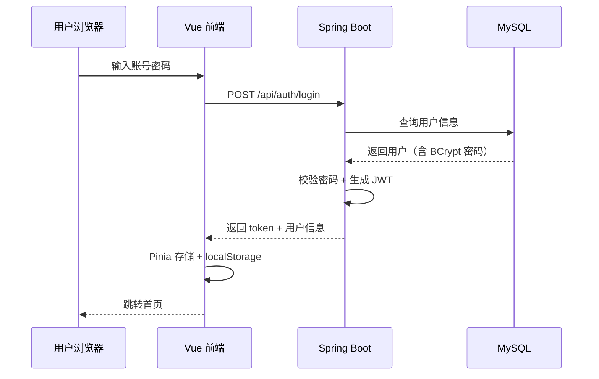
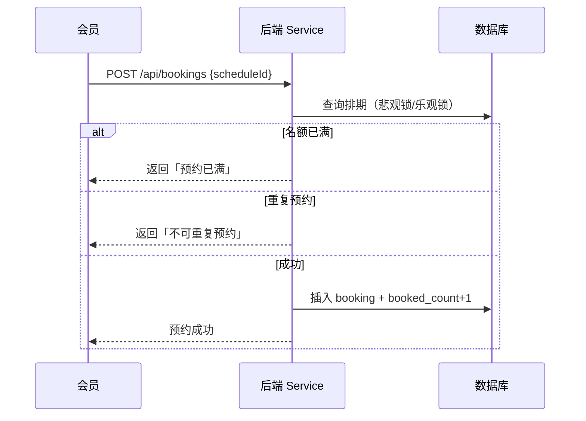




# 资料获取  点击  [**《基于 Spring Boot 与 Vue 健身俱乐部网》资料**](https://nwqbsc0rm1n.feishu.cn/docx/QnFZdiPRloKSzwxY7hdc6MLUnlb)
---

## 1. 项目简介

### 1.1 项目背景

随着全民健身意识的提升，传统健身俱乐部在会员管理、课程排期、商品销售、数据统计等方面仍大量依赖人工或 Excel 表格，存在信息分散、预约冲突、运营效率低等问题。本项目设计并实现一套 **健身俱乐部综合管理系统**，面向会员端与管理员端提供统一的 Web 平台，实现线上化、可视化的俱乐部运营管理。

### 1.2 项目目标

- 为 **会员** 提供课程浏览、在线预约、健身计划记录、商品购买、个人信息维护等功能；
- 为 **管理员/教练** 提供会员档案管理、课程发布与排期、教练分配、商品与订单管理、数据统计看板等功能；
- 采用 **前后端分离** 架构，接口规范清晰，便于二次开发与功能扩展；
- 满足计算机专业 **毕业设计 / 课程设计** 对需求分析、系统设计、数据库设计、编码实现与测试的完整文档要求。

### 1.3 系统角色

| 角色 | 说明 | 主要权限 |
|------|------|----------|
| 游客 | 未登录用户 | 浏览首页、课程列表、公告、商品列表 |
| 会员 | 注册并登录的普通用户 | 预约课程、购买商品、管理个人资料与订单 |
| 教练 | 俱乐部教练账号 | 查看所带课程、学员名单、课程签到 |
| 管理员 | 系统超级用户 | 用户/课程/商品/订单/公告等全模块 CRUD 与统计 |

### 1.4 核心功能概览

```
健身俱乐部网站
├── 前台（会员端）
│   ├── 首页展示（轮播、热门课程、公告）
│   ├── 用户注册 / 登录 / 找回密码
│   ├── 健身课程浏览与在线预约
│   ├── 教练团队介绍
│   ├── 健身商城（商品浏览、购物车、下单）
│   ├── 个人中心（资料、预约记录、订单、健身计划）
│   └── 公告 / 资讯阅读
└── 后台（管理端）
    ├── 仪表盘（会员数、订单量、课程预约统计）
    ├── 会员管理
    ├── 教练管理
    ├── 课程分类与课程管理
    ├── 课程预约 / 签到管理
    ├── 商品分类与商品管理
    ├── 订单管理
    ├── 轮播图 / 公告管理
    └── 系统用户与权限管理
```


---

## 2. 项目技术栈（2024–2026 推荐版本）

### 2.1 后端技术

| 技术 | 版本建议 | 用途说明 |
|------|----------|----------|
| **Java** | JDK 17 / 21 | LTS 版本，配合 Spring Boot 3.x |
| **Spring Boot** | 3.2.x ~ 3.4.x | 核心框架，自动配置、内嵌 Tomcat |
| **Spring Web** | 随 Boot 版本 | RESTful API 开发 |
| **Spring Security** | 6.x | 认证授权、密码加密、接口权限控制 |
| **JWT（jjwt）** | 0.12.x | 无状态 Token 鉴权，前后端分离标配 |
| **MyBatis-Plus** | 3.5.x | ORM 增强，简化 CRUD、分页、条件构造 |
| **MySQL** | 8.0+ | 关系型数据库，支持 JSON 字段、窗口函数 |
| **Redis** | 7.x | 缓存热点数据、验证码、Token 黑名单（可选） |
| **Druid** | 1.2.x | 数据库连接池与 SQL 监控 |
| **Lombok** | 1.18.x | 简化实体类 Getter/Setter/Builder |
| **Hutool** | 5.8.x | 常用工具类（日期、加密、文件等） |
| **Knife4j / SpringDoc** | 4.x | 基于 OpenAPI 3 的接口文档（Swagger 升级版） |
| **Validation** | jakarta.validation | 请求参数校验（@NotNull、@Size 等） |
| **Maven** | 3.9.x | 项目构建与依赖管理 |

> **版本说明**：若课程要求仍使用 Spring Boot 2.7 + Java 8，可将 Security 换为 5.x、javax 包换为 jakarta 前的写法；本文档以 **Spring Boot 3 + Vue 3** 为主线，更贴近当前企业主流技术选型。

### 2.2 前端技术

| 技术 | 版本建议 | 用途说明 |
|------|----------|----------|
| **Vue** | 3.4+ | 组合式 API（Composition API） |
| **Vite** | 5.x | 新一代构建工具，冷启动与 HMR 极快 |
| **Vue Router** | 4.x | 单页应用路由、路由守卫（登录拦截） |
| **Pinia** | 2.x | 状态管理（用户信息、Token、购物车） |
| **Element Plus** | 2.x | 后台管理 UI 组件库 |
| **Axios** | 1.x | HTTP 请求，统一封装拦截器 |
| **ECharts** | 5.x | 后台数据统计图表 |
| **TypeScript** | 5.x（可选） | 类型安全，毕设加分项 |
| **Sass / Less** | — | CSS 预处理器 |

### 2.3 开发与部署工具

| 工具 | 说明 |
|------|------|
| **IntelliJ IDEA** | 后端开发与调试 |
| **VS Code / WebStorm** | 前端开发 |
| **Navicat / DBeaver** | 数据库可视化管理 |
| **Postman / Apifox** | 接口联调与测试 |
| **Git** | 版本控制 |
| **Docker（可选）** | MySQL / Redis 容器化，一键部署 |
| **Nginx** | 生产环境静态资源托管与反向代理 |

### 2.4 技术架构图

```
┌─────────────────────────────────────────────────────────┐
│                      浏览器 (Browser)                    │
│              Vue 3 + Vite + Element Plus                 │
└──────────────────────────┬──────────────────────────────┘
                           │ HTTP / HTTPS (JSON)
                           │ Authorization: Bearer <JWT>
┌──────────────────────────▼──────────────────────────────┐
│                   Nginx（生产环境，可选）                   │
│              静态资源 + /api 反向代理到后端                  │
└──────────────────────────┬──────────────────────────────┘
                           │
┌──────────────────────────▼──────────────────────────────┐
│              Spring Boot 3 应用 (REST API)                 │
│  ┌─────────────┐ ┌──────────────┐ ┌──────────────────┐  │
│  │ Controller  │→│ Service      │→│ Mapper (MP)      │  │
│  └─────────────┘ └──────────────┘ └────────┬─────────┘  │
│  ┌─────────────┐ ┌──────────────┐          │            │
│  │ Security+JWT│ │ 全局异常处理  │          │            │
│  └─────────────┘ └──────────────┘          │            │
└──────────────────────────┬───────────────┼──────────────┘
                           │               │
                    ┌──────▼──────┐  ┌─────▼─────┐
                    │   Redis     │  │  MySQL 8  │
                    │  (缓存)     │  │  (持久化)  │
                    └─────────────┘  └───────────┘
```

---

## 3. 系统功能模块详细设计

### 3.1 用户认证模块

**功能点：**

- 会员注册（用户名、手机号、密码、验证码可选）
- 登录（账号 + 密码，返回 JWT Token）
- 退出登录（前端清除 Token，后端可选 Token 黑名单）
- 修改密码、找回密码（邮箱/手机验证码）
- 基于角色的权限控制（RBAC）：`ROLE_USER`、`ROLE_COACH`、`ROLE_ADMIN`

**技术实现要点：**

```text
1. 密码使用 BCryptPasswordEncoder 加密存储，禁止明文
2. 登录成功后签发 JWT，Payload 包含 userId、username、role
3. 前端 Axios 请求拦截器自动携带 Authorization 头
4. Spring Security 配置白名单：/api/auth/**、/api/public/**
5. 自定义 JwtAuthenticationFilter 解析 Token 并注入 SecurityContext
6. 使用 @PreAuthorize("hasRole('ADMIN')") 做方法级权限控制
```

### 3.2 会员管理模块

**功能点：**

- 会员列表（分页、按姓名/手机号搜索）
- 新增 / 编辑 / 禁用会员
- 会员详情（基本信息、预约记录、消费记录）
- 会员等级 / 会员卡类型（可选扩展：月卡、季卡、年卡）

**核心字段：** 用户名、真实姓名、性别、手机号、邮箱、头像、会员状态、注册时间、到期时间

### 3.3 教练管理模块

**功能点：**

- 教练档案维护（姓名、专长、简介、头像、从业年限）
- 教练与课程关联
- 前台教练团队展示页

### 3.4 课程管理模块

**功能点：**

- 课程分类（瑜伽、动感单车、力量训练、游泳等）
- 课程 CRUD（名称、封面、简介、难度、时长、最大人数、价格）
- 课程排期（日期、时间段、授课教练、剩余名额）
- 会员在线预约（名额扣减、重复预约校验）
- 预约取消 / 签到（管理员或教练操作）

**业务规则示例：**

- 同一会员同一时间段只能预约一门课
- 预约人数达到上限后不可再约
- 开课前 N 小时不允许取消（可配置）

### 3.5 健身商城模块

**功能点：**

- 商品分类（蛋白粉、运动装备、护具等）
- 商品列表与详情（名称、图片、价格、库存、描述）
- 购物车（加入、修改数量、删除）
- 下单与订单管理（待支付、已支付、已发货、已完成）
- 模拟支付或对接支付宝沙箱（扩展项）

### 3.6 内容管理模块

**功能点：**

- 首页轮播图管理（图片 URL、跳转链接、排序）
- 公告 / 健身资讯发布与展示
- 富文本编辑器（WangEditor / TinyMCE）编辑公告正文

### 3.7 数据统计模块（管理端首页）

**功能点：**

- 会员总数、今日新增会员
- 课程预约量趋势（折线图）
- 商品销售额统计（柱状图）
- 热门课程 TOP5（饼图）

**技术实现：** 后端聚合 SQL 或 MyBatis 统计查询 + 前端 ECharts 渲染

---

## 4. 数据库设计

### 4.1 设计原则

- 表名、字段名使用 **小写 + 下划线**（snake_case）
- 每张表包含通用字段：`id`（BIGINT 主键自增）、`create_time`、`update_time`、`is_deleted`（逻辑删除）
- 合理使用外键逻辑（可在应用层维护，便于毕设迁移）
- 字符集：`utf8mb4`，排序规则：`utf8mb4_unicode_ci`

### 4.2 核心数据表

#### 4.2.1 用户表 `sys_user`

| 字段 | 类型 | 说明 |
|------|------|------|
| id | BIGINT | 主键 |
| username | VARCHAR(50) | 登录名，唯一 |
| password | VARCHAR(100) | BCrypt 加密密码 |
| nickname | VARCHAR(50) | 昵称 |
| phone | VARCHAR(20) | 手机号 |
| email | VARCHAR(100) | 邮箱 |
| avatar | VARCHAR(255) | 头像 URL |
| role | VARCHAR(20) | 角色：user/coach/admin |
| status | TINYINT | 0-禁用 1-正常 |
| create_time | DATETIME | 创建时间 |
| update_time | DATETIME | 更新时间 |
| is_deleted | TINYINT | 逻辑删除 0/1 |

#### 4.2.2 教练表 `coach`

| 字段 | 类型 | 说明 |
|------|------|------|
| id | BIGINT | 主键 |
| user_id | BIGINT | 关联 sys_user |
| name | VARCHAR(50) | 教练姓名 |
| specialty | VARCHAR(100) | 专长 |
| introduction | TEXT | 简介 |
| experience_years | INT | 从业年限 |
| avatar | VARCHAR(255) | 形象照 |

#### 4.2.3 课程表 `course`

| 字段 | 类型 | 说明 |
|------|------|------|
| id | BIGINT | 主键 |
| category_id | BIGINT | 分类 ID |
| name | VARCHAR(100) | 课程名称 |
| cover | VARCHAR(255) | 封面图 |
| description | TEXT | 课程介绍 |
| difficulty | TINYINT | 难度 1-3 |
| duration | INT | 时长（分钟） |
| price | DECIMAL(10,2) | 单价 |
| max_capacity | INT | 最大人数 |
| coach_id | BIGINT | 默认教练 |
| status | TINYINT | 上架/下架 |

#### 4.2.4 课程排期表 `course_schedule`

| 字段 | 类型 | 说明 |
|------|------|------|
| id | BIGINT | 主键 |
| course_id | BIGINT | 课程 ID |
| coach_id | BIGINT | 授课教练 |
| schedule_date | DATE | 上课日期 |
| start_time | TIME | 开始时间 |
| end_time | TIME | 结束时间 |
| booked_count | INT | 已预约人数 |
| max_capacity | INT | 名额上限 |

#### 4.2.5 课程预约表 `course_booking`

| 字段 | 类型 | 说明 |
|------|------|------|
| id | BIGINT | 主键 |
| user_id | BIGINT | 会员 ID |
| schedule_id | BIGINT | 排期 ID |
| status | TINYINT | 0-已取消 1-已预约 2-已签到 |
| booking_time | DATETIME | 预约时间 |

#### 4.2.6 商品表 `product`

| 字段 | 类型 | 说明 |
|------|------|------|
| id | BIGINT | 主键 |
| category_id | BIGINT | 分类 |
| name | VARCHAR(100) | 商品名 |
| cover | VARCHAR(255) | 主图 |
| price | DECIMAL(10,2) | 售价 |
| stock | INT | 库存 |
| description | TEXT | 详情 |
| status | TINYINT | 上架状态 |

#### 4.2.7 订单表 `order` / 订单明细 `order_item`

**order：** 订单号、用户 ID、总金额、状态、收货地址、创建时间

**order_item：** 订单 ID、商品 ID、数量、单价、小计

#### 4.2.8 其他表

- `course_category` — 课程分类
- `product_category` — 商品分类
- `banner` — 轮播图
- `notice` — 公告资讯
- `cart` — 购物车（user_id, product_id, quantity）

### 4.3 ER 关系简述

```text
sys_user 1 ── N course_booking
sys_user 1 ── N order
course   1 ── N course_schedule
course_schedule 1 ── N course_booking
coach    1 ── N course / course_schedule
product  N ── 1 product_category
order    1 ── N order_item ── N product
```

---

## 5. 后端 API 设计规范

### 5.1 RESTful 约定

| 方法 | 路径示例 | 说明 |
|------|----------|------|
| GET | /api/courses?page=1&size=10 | 分页查询课程 |
| GET | /api/courses/{id} | 课程详情 |
| POST | /api/courses | 新增课程（管理员） |
| PUT | /api/courses/{id} | 更新课程 |
| DELETE | /api/courses/{id} | 删除课程（逻辑删除） |
| POST | /api/auth/login | 登录 |
| POST | /api/bookings | 提交预约 |
| GET | /api/admin/statistics/overview | 仪表盘数据 |

### 5.2 统一响应格式

```json
{
  "code": 200,
  "message": "success",
  "data": {}
}
```

**常见状态码：**

| code | 含义 |
|------|------|
| 200 | 成功 |
| 400 | 参数错误 |
| 401 | 未登录或 Token 失效 |
| 403 | 无权限 |
| 404 | 资源不存在 |
| 500 | 服务器内部错误 |

### 5.3 分页响应格式

```json
{
  "code": 200,
  "message": "success",
  "data": {
    "records": [],
    "total": 100,
    "current": 1,
    "size": 10
  }
}
```

### 5.4 后端分层结构

```text
com.gym
├── GymApplication.java          # 启动类
├── common
│   ├── Result.java              # 统一响应
│   ├── PageResult.java          # 分页响应
│   └── exception
│       ├── BusinessException.java
│       └── GlobalExceptionHandler.java
├── config
│   ├── SecurityConfig.java
│   ├── MybatisPlusConfig.java
│   ├── CorsConfig.java
│   └── Knife4jConfig.java
├── security
│   ├── JwtUtils.java
│   ├── JwtAuthenticationFilter.java
│   └── UserDetailsServiceImpl.java
├── controller
│   ├── AuthController.java
│   ├── CourseController.java
│   ├── BookingController.java
│   ├── ProductController.java
│   └── admin
│       └── AdminStatisticsController.java
├── service
│   └── impl
├── mapper
├── entity
├── dto          # 请求对象
└── vo           # 响应对象
```

---

## 6. 前端工程设计

### 6.1 目录结构

```text
gym-web/
├── public/
├── src/
│   ├── api/              # 按模块封装接口
│   │   ├── auth.js
│   │   ├── course.js
│   │   └── product.js
│   ├── assets/           # 静态资源
│   ├── components/       # 公共组件
│   ├── layouts/          # 布局（前台 Layout、后台 AdminLayout）
│   ├── router/
│   │   └── index.js      # 路由 + 守卫
│   ├── stores/           # Pinia
│   │   ├── user.js
│   │   └── cart.js
│   ├── utils/
│   │   └── request.js    # Axios 封装
│   ├── views/
│   │   ├── front/        # 会员端页面
│   │   │   ├── Home.vue
│   │   │   ├── CourseList.vue
│   │   │   ├── CourseDetail.vue
│   │   │   ├── Shop.vue
│   │   │   └── UserCenter.vue
│   │   └── admin/        # 管理端页面
│   │       ├── Dashboard.vue
│   │       ├── MemberManage.vue
│   │       └── CourseManage.vue
│   ├── App.vue
│   └── main.js
├── .env.development      # VITE_API_BASE_URL=http://localhost:8080
├── vite.config.js
└── package.json
```

### 6.2 路由与权限

```javascript
// 路由守卫伪代码
router.beforeEach((to, from, next) => {
  const token = localStorage.getItem('token')
  if (to.meta.requiresAuth && !token) {
    next('/login')
  } else if (to.meta.roles && !hasRole(to.meta.roles)) {
    next('/403')
  } else {
    next()
  }
})
```

### 6.3 Axios 拦截器要点

- **请求拦截：** 自动附加 `Authorization: Bearer ${token}`
- **响应拦截：** `code !== 200` 时 ElMessage 提示；`401` 跳转登录页
- **基址配置：** 开发环境 Vite 代理 `/api` → `http://localhost:8080`

### 6.4 UI 设计建议

- **前台：** 偏运动风格，主色可用 `#FF6B35`（活力橙）+ 深灰 `#2D3436`
- **后台：** Element Plus 默认蓝或深色侧边栏 Admin 模板
- 响应式：至少适配 1280px 桌面与 768px 平板

---

## 7. 关键业务流程

### 7.1 用户登录流程



### 7.2 课程预约流程



> **并发提示：** 高并发场景下对 `course_schedule` 行使用 `SELECT ... FOR UPDATE` 或 Redis 分布式锁，毕设可写进「性能优化」章节。

### 7.3 下单流程

1. 用户提交购物车商品 → 校验库存
2. 生成订单号（雪花算法 / 时间戳 + 随机数）
3. 扣减库存、写入订单与明细
4. 返回订单信息（可扩展支付回调）

---

## 8. 安全设计

| 项 | 方案 |
|----|------|
| 身份认证 | JWT + Spring Security |
| 密码存储 | BCrypt 单向哈希 |
| 接口权限 | RBAC + 注解 / Security 配置 |
| CSRF | 前后端分离下关闭 CSRF，依赖 Token |
| XSS | 前端对用户输入转义；后端富文本白名单过滤 |
| SQL 注入 | MyBatis 预编译 `#{}` 参数绑定 |
| 文件上传 | 限制类型与大小，随机文件名，存本地或 OSS |
| 跨域 | CorsConfig 配置允许的前端域名 |

---

## 9. 非功能性需求

### 9.1 性能

- 课程列表、商品列表使用 **分页查询**，单页默认 10 条
- 热门课程、轮播图等读多写少数据可 **Redis 缓存**，TTL 30 分钟
- 数据库对 `user_id`、`schedule_id`、`order_no` 等字段建索引

### 9.2 可维护性

- 前后端分离，接口文档自动生成（Knife4j）
- 统一异常处理与日志（Slf4j + Logback）
- 配置外置：`application-dev.yml` / `application-prod.yml`

### 9.3 可扩展性

- 模块化分包，后续可接入微信小程序端（共用 API）
- 支付、短信、对象存储均预留 Service 接口

---

## 10. 本地运行与部署

### 10.1 环境准备

```text
JDK 17+
Maven 3.9+
Node.js 18+（推荐 LTS）
MySQL 8.0
Redis 7（可选）
```

### 10.2 数据库初始化

```sql
CREATE DATABASE gym_club DEFAULT CHARACTER SET utf8mb4 COLLATE utf8mb4_unicode_ci;
-- 导入项目 sql/gym_club.sql
```

### 10.3 后端启动

```yaml
# application-dev.yml 示例
spring:
  datasource:
    url: jdbc:mysql://localhost:3306/gym_club?useUnicode=true&characterEncoding=utf-8&serverTimezone=Asia/Shanghai
    username: root
    password: your_password
  data:
    redis:
      host: localhost
      port: 6379

jwt:
  secret: your-256-bit-secret-key-here
  expiration: 86400000  # 24h
```

```bash
cd gym-server
mvn spring-boot:run
# 接口文档 http://localhost:8080/doc.html
```

### 10.4 前端启动

```bash
cd gym-web
npm install
npm run dev
# 访问 http://localhost:5173
```

### 10.5 生产部署（简述）

1. 后端 `mvn clean package` 打 jar，``java -jar gym-server.jar --spring.profiles.active=prod``
2. 前端 `npm run build` 生成 `dist/`
3. Nginx 配置：`/` 指向 dist，`/api/` 反向代理到 8080

---

## 11. 测试方案

| 测试类型 | 内容 |
|----------|------|
| 单元测试 | Service 层预约逻辑、库存扣减（JUnit 5 + Mockito） |
| 接口测试 | Postman 集合覆盖登录、CRUD、预约、下单 |
| 前端测试 | 主流程手工测试：注册→登录→预约→购买 |
| 边界测试 | 预约满员、重复预约、库存不足、未登录访问受限接口 |

---

## 12. 项目创新点与亮点（答辩可用）

1. **前后端完全分离**，技术栈与互联网企业主流一致（Spring Boot 3 + Vue 3 + Vite）
2. **JWT 无状态认证**，支持水平扩展
3. **MyBatis-Plus** 简化开发，逻辑删除、自动填充时间字段
4. **ECharts 数据可视化** 管理仪表盘
5. **RESTful + OpenAPI 3** 规范接口，Knife4j 在线调试
6. 可选扩展：Redis 缓存、Docker Compose 一键启环境、支付宝沙箱支付

---

## 13. 项目运行截图


---

## 14. 项目万字文档（设计说明书目录参考）

完整版设计说明书通常包含以下章节，可与源码一并作为毕设提交材料：

```text
摘要
Abstract
第1章 绪论（背景、意义、国内外研究现状）
第2章 相关技术介绍（Spring Boot、Vue 3、MyBatis-Plus、JWT 等）
第3章 系统需求分析（可行性、功能需求、非功能需求、用例图）
第4章 系统总体设计（架构设计、功能模块、技术选型）
第5章 数据库设计（E-R 图、数据表结构、数据字典）
第6章 系统详细设计与实现（各模块界面与关键代码说明）
第7章 系统测试（测试环境、用例、结果）
第8章 总结与展望
参考文献
致谢
```


---

## 15. 项目资料


源码包一般包含：

```text
健身俱乐部网站/
├── gym-server/          # Spring Boot 后端
├── gym-web/             # Vue 3 前端
├── sql/
│   └── gym_club.sql     # 数据库脚本
├── docs/                # 设计说明书 Word/PDF
└── README.md            # 运行说明
```

---

👇🏻 精彩专栏 **推荐订阅** 👇🏻 在下方专栏👇🏻不然下次找不到哟

[**《Java精品推荐项目》**](https://itxiongmao.blog.csdn.net/category_9538286.html)

[**《springboot+vue项目100套》**](https://blog.csdn.net/bruceliu_code/category_12767267.html)

[**《ssm项目100套》**](https://blog.csdn.net/bruceliu_code/category_12768956.html)

[**《微信小程序合集》**](https://blog.csdn.net/bruceliu_code/category_10034398.html)
